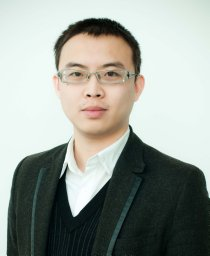
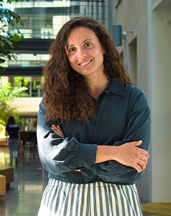

## **The First Workshop of Evaluation of Multi-Modal Generation**

    Multimodal generation techniques have opened new avenues for creative content generation.  However, evaluating the quality of multimodal generation remains underexplored and some key questions are unanswered, such as the contributions of each modal, the utility of pre-trained large language models for multimodal generation, and measuring faithfulness and fairness in multimodal outputs.  This workshop aims to foster discussions and research efforts by bringing together researchers and practitioners in natural language processing, computer vision, and multimodal AI. Our goal is to establish evaluation methods for multimodal research and advance research efforts in this direction. 

## **Schedule**

<b>Date: 20 January 2025 (Monday)</b>

<table>
  <tr style="background-color: #807e7e; color: white;">
    <th style="width: 180px;">Time</th>
    <th>Presentation Details</th>
  </tr>
  <tr>
    <td>9:00 - 9:10</td>
    <td>Opening</td>
  </tr>
  <tr>
    <td>9:10 - 10:10</td>
    <td><b>Keynote I - A/Prof Qi Wu</b> Topic: Reasoning is Measurable: Two new evaluation datasets & metrics on LLMs and MLLMs</td>
  </tr>
  <tr>
    <td>10:10 - 10:30</td>
    <td><b>Paper presentation</b> CVT5: USING COMPRESSED VIDEO ENCODER AND UMT5 FOR DENSE VIDEO CAPTIONING <i>Authors: Mohammad Javad Pirhadi, Motahhare Mirzaei and Sauleh Eetemadi</i></td>
  </tr>
  <tr>
    <td>10:30 - 11:00</td>
    <td>Conference tea break</td>
  </tr>
  <tr>
    <td>11:00 - 12:00</td>
    <td><b>Keynote II - Prof Timothy Baldwin</b> Topic: TBD</td>
  </tr>
  <tr>
    <td>12:00 - 13:00</td>
    <td><b>Paper presentation</b> TAIWANVQA: A BENCHMARK FOR VISUAL QUESTION ANSWERING FOR TAIWANESE DAILY LIFE <i>Authors: Hsin-Yi Hsieh, Shang Wei Liu, Chang Chih Meng, Shuo-Yueh Lin, Chen Chien-Hua, Hung-Ju Lin, Hen-Hsen Huang and I-Chen Wu</i>  A DATASET FOR PROGRAMMING-BASED INSTRUCTIONAL VIDEO CLASSIFICATION AND QUESTION ANSWERING <i>Authors: Sana Javaid Raja, Adeel Zafar and Aqsa Shoaib</i>  LLAVA-RE: BINARY IMAGE-TEXT RELEVANCY EVALUATION WITH MULTIMODAL LARGE LANGUAGE MODEL <i>Authors: Tao Sun, Oliver Liu, JinJin Li and Lan Ma</i></td>
  </tr>
  <tr>
    <td>13:00 - 14:00</td>
    <td>Conference lunch</td>
  </tr>
  <tr>
    <td>14:00 - 15:00</td>
    <td><b>Keynote III - Dr Yova Kementchedjhieva</b> Topic: Fine-grained Image Caption Generation and Evaluation</td>
  </tr>
  <tr>
    <td>15:00 - 15:20</td>
    <td><b>Paper presentation</b> GUIDING VISION-LANGUAGE MODEL SELECTION FOR VISUAL QUESTION-ANSWERING ACROSS TASKS, DOMAINS, AND KNOWLEDGE TYPES <i>Authors: Neelabh Sinha, Vinija Jain and Aman Chadha</i></td>
  </tr>
  <tr>
    <td>15:30 - 16:00</td>
    <td>Conference tea break</td>
  </tr>
  <tr>
    <td>16:00 - 16:40</td>
    <td><b>Papers presentation</b> IF I FEEL SMART, I WILL DO THE RIGHT THING: COMBINING COMPLEMENTARY MULTIMODAL INFORMATION IN VISUAL LANGUAGE MODELS <i>Authors: Yuyu Bai and Sandro Pezzelle</i>  PERSIAN IN A COURT: BENCHMARKING VLMS IN PERSIAN MULTI-MODAL TASKS <i>Authors: Farhan Farsi, Shahriar Shariati Motlagh, Shayan Bali, Sadra Sabouri and Saeedeh Momtazi</i></td>
  </tr>
</table>

 

## **Call for Papers**

Both long paper and short papers (up to 8 pages and 4 pages respectively with unlimited references and appendices) are welcomed for submission. 

A list of topics relevant to this workshop (but not limited to):

- Evaluation metrics for multimodal text generation for assessing informativeness, factuality and faithfulness 

- New benchmark datasets, evaluation protocols and annotations

- Challenges in evaluating multimodal coherence, relevance and contribution of modalities and inter- and intra-interactions

- Assessing information integration and aggregation across multiple modalities 

- Adversarial evaluation approaches for testing the robustness and reliability of multimodal generation systems

- Ethical considerations in the evaluation of multimodal text generation, including bias detection and mitigation strategies

- Multilingual multimodal text generation systems for low-resource languages

- Evaluating fairness and privacy in multimodal learning and applications

## **Important Dates**

- Nov 20, 2024: Paper submission due date

- Dec 05, 2024: Notification of acceptance

- Dec 11, 2024: Camera-ready version due

- Jan 20, 2025: Workshop Date

Note: All deadlines are 11:59PM UTC-12:00 (“Anywhere on Earth”)

## **Submission Instructions**

You are invited to submit your papers in our <a href="https://softconf.com/coling2025/EvalMG25">START/SoftConf submission portal</a>. All the submitted papers have to be anonymous for double-blind review. The content of the paper should not be longer than 8 pages for long papers and 4 pages for short papers, strictly following the <a href="https://coling2025.org/calls/submission_guidlines/">COLING 2025 templates</a>, with the mandatory limitation section not counting towards the page limit. Supplementary and appendices (either as separate files or appended after the main submission) are allowed. We encourage code link submissions for reproducibility.

### ***Non-archival Option***

To promote discussions within the community, our workshop includes non-archival track. Authors have the flexbility to submit their unpublished work or papers accepted to COLING main conference to our workshop. The organisers may offer the opportunity to give oral or poster presentation. 

## **Invited Speakers**

<table style="border-collapse: collapse; border: none; width: 100%;">
  <tr>
    <td style="border: none; width: 30%; text-align: center;">
      <h3>Timothy Baldwin</h3>
       
    </td>
    <!-- Adjust width for the text column -->
    <td style="border: none; width: 70%; text-align: left;">
      

      Professor Tim Baldwin is Provost and Professor of Natural Language Processing at Mohamed bin Zayed University of Artificial Intelligence (MBZUAI), in addition to being a Melbourne Laureate Professor in the School of Computing and Information Systems, The University of Melbourne and Chief Scientist of LibrAI, a start-up focused on AI safety. Tim completed a BSc(CS/Maths) and BA(Linguistics/Japanese) at The University of Melbourne in 1995, and an MEng(CS) and PhD(CS) at the Tokyo Institute of Technology in 1998 and 2001, respectively. He joined MBZUAI at the start of 2022, prior to which he was based at The University of Melbourne for 17 years. His research has been funded by organisations including the Australian Research Council, Google, Microsoft, Xerox, ByteDance, SEEK, NTT, and Fujitsu. He is the author of over 500 peer-reviewed publications across diverse topics in natural language processing and AI, in addition to being an ARC Future Fellow, and the recipient of a number of awards at top conferences.
      

    </td>
  </tr>
</table>

<table style="border-collapse: collapse; border: none; width: 100%;">
  <tr>
    <td style="border: none; width: 30%; text-align: center;">
      <h3>Qi Wu</h3>
       
    </td>
    <!-- Adjust width for the text column -->
    <td style="border: none; width: 70%; text-align: left;">
      

      Dr Qi Wu is an Associate Professor at the University of Adelaide and was the ARC Discovery Early Career Researcher Award (DECRA) Fellow between 2019-2021. He is the Director of Vision-and-Language at the Australia Institute of Machine Learning. Australian Academy of Science awarded him a J G Russell Award in 2019. He obtained his PhD degree in 2015 and MSc degree in 2011, in Computer Science from the University of Bath, United Kingdom. His research interests are mainly in computer vision and machine learning. Currently, he is working on the vision-language problem, and he is primarily an expert in image captioning and visual question answering (VQA). He has published more than 100 papers in prestigious conferences and journals, such as TPAMI, CVPR, ICCV, ECCV. He is also the Area Chair for CVPR and ICCV.
      

    </td>
  </tr>
</table>

<table style="border-collapse: collapse; border: none; width: 100%;">
  <tr>
    <td style="border: none; width: 30%; text-align: center;">
      <h3>Yova Kementchedjhieva</h3>
       
    </td>
    <!-- Adjust width for the text column -->
    <td style="border: none; width: 70%; text-align: left;">
      

      Dr Yova Kementchedjhieva is an assistant professor of Natural Language Processing at the Mohamed bin Zayed University of Artificial Intelligence (MBZUAI). Her research concerns language generation in multimodal and cross-lingual contexts. She is interested in knowledge grounding and transfer learning, most recently in the area of vision-and-language processing.
      Prior to joining MBZUAI, Kementchedjhieva was a postdoctoral researcher in the department of computer science at the University of Copenhagen. During her time at the University of Copenhagen, she worked on conditional text generation across a range of tasks, including grammatical error correction, dialog generation and image captioning. Her earlier work concerned multilingual natural language processing, with a focus on cross-lingual embedding alignment. While at Copenhagen, she also worked as a teaching assistant, gave lectures for beginner and advanced NLP courses, and interned at Google LLC. and DataMinr in a researcher capacity.
      

    </td>
  </tr>
</table>

## **Organisers**

- Wei Emma Zhang, The University of Adelaide
- Xiang Dai, CSIRO
- Desmond Elliot, University of Copenhagen
- Byron Fang, CSIRO
- Haojie Zhuang, The University of Adelaide
- Mong Yuan Sim, The University of Adelaide & CSIRO
- Weitong Chen, The University of Adelaide
